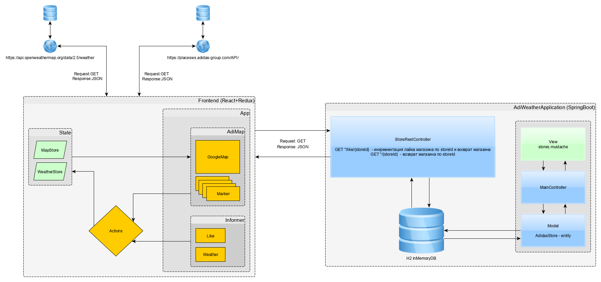

# AdiWeather 
### Backend and Rest Service for AdiWeather WebApp

1. Start app with Spring Boot and go to http://localhost:8080 
for view AdidasStore likes
2. For like store GET to http://localhost:8080/like/{storeId}
3. For get store GET to http://localhost:8080/{storeId}

### Frontend:

1. Run npm install in frontend dir
2. Run npm react-scripts start
3. Go to http://localhost:3000 and use app

### Structure:

